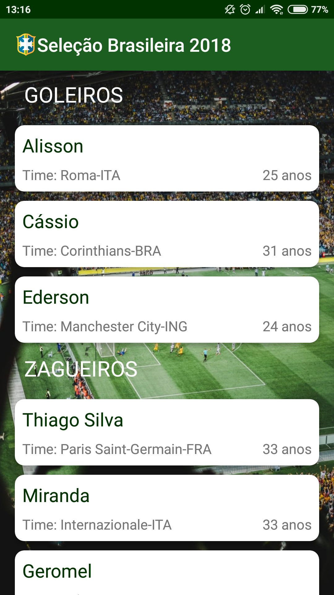

# RecyclerViewMultipleViewType
RecyclerView dividido em seções com títulos (Exemplo com retorno de API)

## Screenshots</br>

<p align="center">
  
</p>

## Usage

### Simple usage

```
public class RecyclerAdapter extends RecyclerView.Adapter<RecyclerView.ViewHolder> {

    private List<JogadoresModel> mList;

    public RecyclerAdapter(List<JogadoresModel> list) {
        this.mList = list;
    }

    @Override
    public RecyclerView.ViewHolder onCreateViewHolder(ViewGroup parent, int viewType) {
        View view;

        switch (viewType) {
            case PAI:
                view = LayoutInflater.from(parent.getContext()).inflate(R.layout.row_item_header, parent, false);
                return new PaiViewHolder(view);
            case FILHO:
                view = LayoutInflater.from(parent.getContext()).inflate(R.layout.row_item_filho, parent, false);
                return new FilhoViewHolder(view);
        }
        return null;
    }

    @Override
    public void onBindViewHolder(RecyclerView.ViewHolder holder, int position) {
        JogadoresModel object = mList.get(position);
        if (object != null) {
            switch (object.getmTipo()) {
                case PAI:
                    ((PaiViewHolder) holder).mTitle.setText(object.getmNome());
                    break;
                case FILHO:
                    ((FilhoViewHolder) holder).mNome.setText(object.getmNome());
                    ((FilhoViewHolder) holder).mTime.setText(String.format("Time: %s", object.getmTime()));
                    ((FilhoViewHolder) holder).mIdade.setText(String.format("%d anos", object.getmIdade()));
                    break;
            }
        }
    }

    @Override
    public int getItemCount() {
        if (mList == null)
            return 0;
        return mList.size();
    }

    @Override
    public int getItemViewType(int position) {
        if (mList != null) {
            JogadoresModel object = mList.get(position);
            if (object != null) {
                return object.getmTipo();
            }
        }
        return 0;
    }

    public static class PaiViewHolder extends RecyclerView.ViewHolder {
        private TextView mTitle;

        PaiViewHolder(View itemView) {
            super(itemView);
            mTitle = itemView.findViewById(R.id.titleTextView);
        }
    }

    public static class FilhoViewHolder extends RecyclerView.ViewHolder {
        private TextView mNome, mTime, mIdade;

        FilhoViewHolder(View itemView) {
            super(itemView);
            mNome = itemView.findViewById(R.id.txtNome);
            mTime = itemView.findViewById(R.id.txtTime);
            mIdade = itemView.findViewById(R.id.txtIdade);
        }
    }
}
        
```

## Author</br>

* Jonas Vieira - jonasvieira.ti@gmail.com </br>
 
[](https://br.linkedin.com/in/jonasvieirati)
